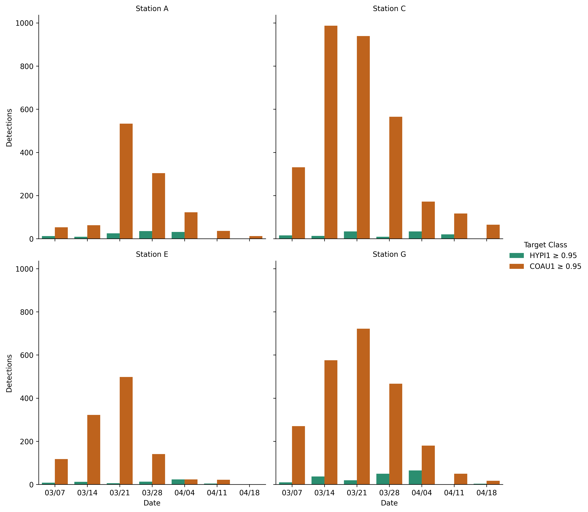

.. pycnet-audio documentation master file, created by
   sphinx-quickstart on Thu May 16 10:55:42 2024.
   You can adapt this file completely to your liking, but it should at least
   contain the root `toctree` directive.

Welcome to pycnet-audio!
========================
.. admonition:: Version information

	This document is for pycnet-audio version |release| and was generated |today|.

.. contents:: Contents

**pycnet-audio** is a software package for bioacoustics data processing using the PNW-Cnet deep learning model. pycnet-audio provides easy-to-use command-line tools for executing standard data processing workflows. As a Python package, it also provides importable modules that can be incorporated into your Python code to define your own workflows for processing audio data. To see the formal package documentation, check the links under Module Reference. For installation instructions, detailed usage notes, and tutorials, keep reading.

This guide generally assumes that you are running a 64-bit version of Windows. pycnet-audio is theoretically platform-agnostic, but we have not tested it extensively on GNU/Linux or MacOS systems. Language geared toward users on these platforms may be added in the future. pycnet-audio will not run on 32-bit operating systems.

Background
----------

The PNW-Cnet model was developed by the U.S. Forest Service and is used to facilitate passive acoustic monitoring of Northern spotted owls (*Strix occidentalis caurina*; "NSO") and other forest wildlife in the Pacific Northwest, U.S.A. The NSO monitoring program is now one of the largest acoustic data collection efforts in the world, generating >2 million hours of recordings annually from >1,000 field sites in Washington, Oregon, and California. PNW-Cnet was first developed in 2018 and has since undergone several major retrainings; the current version, PNW-Cnet v5, detects ca. 75 species of wild birds and mammals found in the Northwest, as well as various forms of anthropogenic and environmental noise.

For more information on the NSO monitoring program, `visit our website <https://www.damonlesmeister.com/>`_.

.. admonition:: A note on naming

	The name **pycnet** is a portmanteau of **Py**\thon and PNW-**Cnet**\, chosen for being short, punchy, and easy to type. The main importable module provided by this package is called pycnet, as is the main command-line tool used to process data, so we initially planned to use pycnet as the name of the distribution package as well. Tragically, this name was already taken on PyPI.org, so to avoid ambiguity, the distribution package is called pycnet-audio. Practically, this just means you'll need to use the name **pycnet-audio** when installing or updating the package using pip. For all other purposes, including running the command-line tools as well as using the functions and classes exported by the module in your own code, use **pycnet**.

I. Installation
===============

pycnet-audio is distributed through the `Python Package Index <https://pypi.org/>`_ using standard Python package management tools. The most straightforward way to get everything set up is to install a `Conda <https://en.wikipedia.org/wiki/Conda_(package_manager)>`_ client and use it to install pycnet-audio in a dedicated *conda environment*. This streamlines the installation and also ensures that the different components can all find each other when you are ready to use the program. (You can think of a Conda environment as a self-contained Python installation that can be created, configured, and deleted without affecting the operation of other software on your system. Conda environments can also be readily "cloned," which makes it straightforward to set up identical environments on multiple machines.)

Step 1. Install Miniconda
-------------------------

We recommend using Miniconda as your conda client, as it is designed to be lightweight and modular. The other main client, Anaconda, is a fairly heavy-duty suite of scientific software, most of which is not relevant for our purposes. However, either program should work. Instructions for installing Miniconda can be found `here <https://www.anaconda.com/docs/getting-started/miniconda/install>`_. Once Miniconda is installed, you will have access to a command-line interface called Anaconda Prompt, which you can then use to install everything else. 

Step 2. Create a conda environment
----------------------------------

Open the Anaconda Prompt and run 
::

	conda create -n pycnet -c conda-forge sox python=3.11

Hit Enter when you are prompted to proceed.

This will create a new conda environment called ``pycnet`` and will install Python version 3.11 and SoX to it. (`SoX <https://sourceforge.net/projects/sox/>`_ is an open-source command-line program that pycnet uses for some aspects of audio processing. Here we are installing SoX as a package from the `conda-forge repository <https://conda-forge.org/>`_, which is maintained by the open-source community; unlike the repositories maintained by Anaconda, Inc., it does not require a license to use.)

If all goes well, you should see a message that looks like this:
::

	Preparing transaction: done
	Verifying transaction: done
	Executing transaction: done
	#
	# To activate this environment, use
	#
	#     $ conda activate pycnet
	#
	# To deactivate an active environment, use
	#
	#     $ conda deactivate

	(base) C:\Users\zjruf>

Note the ``(base)`` at the beginning of the prompt on the last line. This indicates that the ``base`` Conda environment is active. 

Step 3. Install pycnet-audio
----------------------------

As mentioned in the message above, we can now activate the ``pycnet`` environment by running
::

	conda activate pycnet

(Note that we omit the dollar sign - the ``$`` in the conda output above is meant as a stand-in for the prompt itself and is not part of the actual command.) The ``(base)`` indicator in the command prompt will change to ``(pycnet)``, indicating that the pycnet environment is now active and we can install things to it. Now run 
::

	pip install pycnet-audio

``pip`` is the most common tool used to install third-party Python packages and comes bundled with all modern Python installations. When you run this command, pip will search the Python Package Index for the **pycnet-audio** package and will automatically install the latest version and its dependencies (and its dependencies' dependencies, etc.) to the pycnet environment. This may take some time and there will be a lot of output in the console, but as long as you don't see the word ``ERROR``, everything is probably working fine.

.. note::

	If you ever want to update pycnet-audio (or any other package), you can do so by running
	::

		pip install --upgrade pycnet-audio
	
	If the package has a release listed on PyPI.org that's newer than the version you're using, pip will automatically download and install it for you. You can also specify an exact version of the package you want, which doesn't have to be newer than the one currently installed, so this can also be used to "downgrade" a package to an older version. See `pip's documentation <https://pip.pypa.io/en/stable/user_guide/>`_ for details.

Step 4. (Optional) Test pycnet-audio
------------------------------------

Once the package has been installed, you can verify that everything is working correctly by running 
::

	test_pycnet

This will run the TestPycnet script, which will create a temporary folder in the current working directory, synthesize a short audio file using SoX, generate a set of spectrograms, process them using the PNW-Cnet model, and extract and verify a set of apparent target class detections. Again, there will be a certain amount of output in the console, most of which can be ignored, although it may be an illustrative example of output from processing data. If everything works as it should, then you will ultimately see a message like this:
::

	################################################################################
	################################ Test complete. ################################

	pycnet appears to be working correctly. Hooray!

	Remove files and folders created for this test? [Y/n]

Hit Enter to delete the temporary test folder, then give yourself a pat on the back. You have successfully installed pycnet-audio!

Alternatives
------------

We recommend installing pycnet-audio in a dedicated conda environment for overall simplicity and ease of dependency management; however, it is not strictly necessary. If you already have a compatible Python installation that you want to continue using, you can simply install pycnet-audio using pip without going through steps 1 and 2 above.

In this case, you will need to install SoX as a standalone program. Simply `download the SoX installer <https://sourceforge.net/projects/sox/>`_ from the project page and run it as an executable. It doesn't really matter where SoX is installed, but you will need to make sure its install location is listed in your PATH environment variable, such that your operating system knows where to find the program if you call e.g. ``sox --version`` from the command line.

II. Using pycnet
================

In the course of running a large-scale acoustic monitoring program, we have developed a reasonably efficient workflow for processing bioacoustics data. This workflow consists of a number of distinct steps that are completed in sequence, beginning with a set of audio files that have been retrieved from the field and ending with a set of target species detections that can be analyzed to make ecological inferences. The steps in our workflow are as follows:

1. The files are organized in a directory structure that reflects the field sampling scheme. Each recording station has a folder containing the audio files from that station, and each field site has a folder containing the station folders from that site. Filenames are standardized to include information on where and when each recording was made.
2. Audio files from each field site are inventoried and summarized at the site and station level.
3. A set of spectrograms representing short segments of the audio is generated in the form of image files.
4. The spectrogram image files are processed and classified using the PNW-Cnet model to produce a set of class scores. Every image has a score for every class included in the model.
5. The class scores are filtered according to a set of review criteria, which maps target classes to score thresholds. In other words, each class (sonotype) that we are interested in has a corresponding score threshold, and the set of `apparent detections` for a given class is the set of images (and their matching audio segments) to which PNW-Cnet assigned a score greater than or equal to the threshold for that class.
6. If necessary, the apparent detections for each class we are interested in are reviewed manually to produce a set of human-confirmed detections, grouped at the appropriate spatial and temporal scale. The amount of review effort can be tailored to project goals and level of interest in each species or class. For instance, some classes might be reviewed in more detail to produce a detection history for each recording station with weekly sampling occasions. Others might only be reviewed enough to confirm the presence of a species at each field site.

pycnet is not designed to encompass every aspect of this workflow, since it is more efficient to use purpose-made software for some tasks. Rather, it is intended to provide a straightforward and efficient processing pipeline to enable ecological analyses based on acoustic data.

Basic usage
-----------
.. note::

	If you installed pycnet-audio in a Conda environment, you'll need to run the tool with the appropriate environment active, denoted by the ``(pycnet)`` active environment indicator at the start of the prompt. If it isn't there, activate the environment by running 
	:: 

		conda activate pycnet

The command-line tools provided by pycnet-audio can be run from a shell program like the Anaconda Prompt, Windows PowerShell, bash, etc. You run the tool by invoking the ``pycnet`` command followed by a set of `arguments`. The basic usage will look something like this:
::

	pycnet process F:\COA_23459 -c v4
	
Here we are supplying three arguments:

- ``process`` is the `mode` that we are running pycnet in. This tells pycnet what we want to do - in this case, we want to run through the full processing pipeline outlined above.
- ``F:\COA_23459`` is the `target directory`, the path to a folder on our computer which contains the data we want to process.
- ``-c v4`` is an `optional argument` which includes a `flag`, ``-c``, and a `value`, ``v4``. In this case we are telling pycnet that we want to use version 4 of the PNW-Cnet model to generate class scores.

What actually happens when we run this command? Quite a lot, as it turns out:

1. pycnet searches the directory tree rooted at ``F:\COA_23459`` for files with a .wav extension. Every .wav file found is added to a table which keeps track of the file's location (relative to F:\COA_23459), name, size, and duration. This table is written to a file called ``COA_23459_wav_inventory.csv`` in the target directory.
2. pycnet creates a folder called ``Temp`` under ``F:\COA_23459``. This folder contains a subfolder called ``images``, which in turn contains one or more subfolders called ``Part_01``, ``Part_02``, etc., depending on the total duration of the audio data.
#. pycnet begins generating spectrograms representing non-overlapping 12-second segments of the audio in the frequency range 0-4000 Hz and saving them as image files. Images are saved in PNG format in the ``Temp\images\Part_xx`` folders.
#. pycnet loads the trained PNW-Cnet v4 model and begins feeding it batches of image data from the spectrograms that have just been generated. For each image, the model generates a set of 51 class scores, one for each of the target classes included in this version of the model. The names of the images and their corresponding class scores are placed in a table, which is saved to a file called ``COA_23459_v4_class_scores.csv`` in the target directory.
#. pycnet builds a table of counts of apparent detections for all target classes across a range of score thresholds based on the class score table. The count values represent the number of rows in the class score table where the score for each class exceeded the threshold. These counts are summed for each unique combination of site, recording station, date, and score threshold.
#. pycnet searches for apparent target class detections to be reviewed manually. Because we did not provide a review settings, the clips to be reviewed will be based on the default review criteria, i.e., rows where the score for either of the northern spotted owl classes (STOC and STOC_IRREG) was >= 0.25, or where the score for at least one other class was >= 0.95. pycnet places these detections in a table that is formatted to be browsable using Wildlife Acoustics, Inc.'s Kaleidoscope software. This table is then saved to a file called ``COA_23459_review_kscope.csv`` in the target directory.

Phew! As you can see, pycnet is capable of running through a fairly involved workflow without much input from the user. However, you can tailor the processing operation extensively to fit your needs by providing various command-line arguments. These arguments are essentially a formal syntax for telling pycnet what you actually want to do. The following sections describe the required and optional arguments in more detail.

Required arguments
------------------

Mode
++++

When you run the ``pycnet`` command, you almost always need to supply a mode and a target directory, in that order. Again, the **mode** is typically a single lowercase word that indicates what you want pycnet to do. 

Here is the full list of acceptable modes and what each of them does:

	``process`` 
		Inventory the audio files; generate spectrograms; generate class scores; summarize apparent detections; and generate the review file. This is intended to be the "bread-and-butter" option for normal data processing.

	``batch_process``
		Same as ``process``, but process a list of directories instead of just one. The paths to the target directories are read from a text file. Target directories will be processed in sequence using the same set of options.

	``spectro`` 
		Inventory the audio files (if necessary) and generate the spectrograms.

	``predict`` 
		Generate class scores from an existing set of spectrograms; summarize apparent detections; and generate the review file. Useful if you want to process the same data with multiple versions of the PNW-Cnet model.

	``review`` 
		Summarize apparent detections from an existing set of class scores and generate a review file. Useful if you want to experiment with different review settings.

	``inventory`` 
		Inventory the audio files and write the information to a CSV file.

	``rename`` 
		Standardize filenames to the format expected by the program, consisting of a prefix (either supplied by the user or based on the directory structure) and the date and time when the recording began. If the filename already contains a timestamp in YYYYMMDD_HHMMSS format, that timestamp will be retained. If not, pycnet will create a timestamp for each file based on the file's last modification time.

	``combine``
		Combine processing output files (class score files, audio file inventory files, detection summary files, review files, and processing log files) from several target directories. The output files for the individual directories will be removed once the combined files have been created. (When processing data in ``batch_process`` mode, you can include the ``-m`` flag to do this automatically; see below for details.)

	``cleanup``
		Recursively delete the spectrograms and the temporary folder in which they were generated. (This will be done automatically in some other modes if you include the ``-a`` flag; see below.)

Target directory
++++++++++++++++

The **target directory** can be any folder on your computer, although if the folder doesn't contain any audio data, then pycnet will not be able to do much with it.

You need to supply the target directory in the form of an `absolute path`. On a Windows machine this means it needs to include a drive letter and any intermediate directories in addition to the name of the folder itself. If you are viewing the folder in File Explorer, you can click on the address bar near the top of the window to highlight and copy the full path. You can also hold ``Shift`` and right-click on a folder in the File Explorer main pane and select ``Copy as path`` to copy the absolute path to the item.

pycnet will search the target directory for audio files with a .wav extension (or .flac if you supply the -f option when invoking the program). This search is recursive, so .wav files contained in subfolders will also be found. However, we recommend keeping the directory structure simple and obvious, with a folder for each recording station containing the .wav files for that station, and a folder for each field site containing the folders for the recording stations at that site, e.g.
::

	F:/
	|__ COA_23459
		|___ Stn_A
			|_____ COA_23459-A_20230608_121502.wav
			|_____ COA_23459-A_20230608_130002.wav
			|_____ COA_23459-A_20230608_140002.wav
			|_____ COA_23459-A_20230608_150002.wav
						...
			|_____ COA_23459-A_20230723_084102.wav

		|___ Stn_B
			|_____ COA_23459-B_20230608_132709.wav
						...
			...

If you are running pycnet in ``batch_process`` or ``combine`` mode, then instead of a path to a directory, you should provide the full path to a text file listing the paths of directories to be processed, one on each line. pycnet will process these directories in sequence, just as if you had manually run ``pycnet process`` on each of them. Note that regardless of the file extension, the *contents* of the file should be plain text. (It might be convenient to use Excel or a similar program to create and edit the file, but if you do, make sure to save it as a CSV file rather than as an Excel workbook.)

.. Important::
	It is worth thinking carefully about how to organize and name your files, ideally before you ever deploy your ARUs. As outlined above, we recommend structuring your folders in a way that reflects your sampling scheme. Additionally, we recommend giving your audio files informative names so that the origin of any given file can be readily determined from its name. For instance, the filename format used by the spotted owl monitoring program includes a study area code, field site ID, recording station ID, date, and time, in that order, so our filenames look like this::

		COA_23459-A_20230608_121502.wav

	Looking at the filename above, we know that this file was recorded in the Oregon Coast Range (COA) study area, at site 23459, recording station A, and that the recording began on Jun 8, 2023, starting at 12:15:02 PM. Conceptually, the name of each .wav file includes information on where and when the recording was made, ordered from most general to most specific, which is a useful property.

	**As of version 0.5.7,** pycnet no longer assumes that your filenames adhere to this specific format. pycnet now expects filenames to consist of a prefix and a timestamp. The timestamp **must** be in ``YYYYMMDD_HHMMSS`` format (e.g. ``20241202_090530``), must be the final portion of the filename (i.e. it should be followed immediately by the .wav file extension), and must be preceded by an underscore (``_``). However, the prefix can follow any format you like. The following examples would all be considered valid filenames:
	::

		S4A10056_20230531_140000.wav 

		ARU_73_20230321_182400.wav

		A-B-10.3_20240719_083157.wav

	We still recommend using a naming convention similar to the one described above, as long as it is appropriate for your sampling design, but the program is now less likely to crash if you don't. The practical significance of the prefix structure is discussed more in `Appendix A. Output files`_ below.

	Last but certainly not least, **please make sure that the name of each audio file is unique.** Ideally your filenames should be unique across your entire study, but at the very least they should be unique within each dataset that you process. Datasets containing non-unique filenames may result in misleading output and flawed inferences!

	See `Appendix D. Renaming audio files`_ below for information about using pycnet to standardize your filenames. 

In addition to the above advice on filename formatting, we strongly recommend that you avoid using spaces in the names of your files and folders, as this can introduce various unintended behavior when processing data; underscores are a safe alternative. If you want to process data in a location whose path includes spaces, then you will need to enclose the target directory argument in double quotes when calling pycnet, e.g.
::

	pycnet process "F:\2024 ARU Data\KLA_16408"

This tells the interpreter to treat the text within the quotes as a single value rather than splitting the text at the spaces and treating each component as a separate value. The Windows "Copy as path" option described above will automatically add quotes around the path. (Paths that don't contain spaces do not need to be enclosed in quotes, but it won't hurt anything if you do.)

Optional arguments
------------------

In addition to the processing mode and the target directory, which are required, you can specify a number of other, optional arguments. Some of these are used by including a flag followed by a value, e.g. ``-c v4``, somewhat like assigning a value to a variable. Others (``-a``, ``-f``, ``-l``, ``-k``, ``-m``, and ``-q``) can be used without specifying an additional value; in these cases, the flag itself acts as a switch that turns specific behaviors on or off.

The available optional arguments are as follows:

 ``-h`` (Help)
	Prints a summary of the available options and exits. This option is a special case, as it can be used without specifying a mode or target directory.

 ``-a`` (Auto-cleanup)
	Recursively delete the temporary folder that was created to hold the spectrogram image files once processing is complete. This flag does not need to be paired with a value.

 ``-c`` (Cnet version)
	The version of the PNW-Cnet model to use when generating class scores. Options: "v4" or "v5". Default: v5.

 ``-i`` (Image directory) 
	Allows you to specify a location where the temporary spectrogram directory should be created. If not provided, the spectrograms will be generated in a folder called Temp within the target directory. This can improve processing speed, e.g. generating spectrograms in a folder on a solid-state drive will allow you to take advantage of the SSD's higher read and write speeds.

 ``-l`` (Log output to file)
	Tell pycnet to copy output messages to a file in the target directory, in addition to displaying them in the console. This flag does not need to be paired with a value. 

 ``-o`` (Output file)
	Specify a name to be used for the review file instead of the default name. Useful if you want to experiment with different review settings without overwriting a previously generated file.

 ``-p`` (Prefix)
	Use a specific prefix when renaming files. This can be a fixed string (e.g. "COA_10226-B") or it can incorporate "wildcard" characters that will take their value from specific aspects of the file's location in a directory. This is a bit involved; see `Appendix D. Renaming audio files`_ below for details on how this works.

 ``-q`` (Quiet mode)
	Suppress progress bars when generating spectrograms and class scores. This flag does not need to be paired with a value.

 ``-r`` (Review settings)	
	You can specify review criteria in two different ways. First, you can supply the path to a CSV file specifying criteria to use when generating the review file. The file provided must have a column called "Class" listing the codes of the classes that you want included and another column called "Threshold" listing the score threshold (a decimal value between 0 and 1) to use to define apparent detections for each class. Alternatively, you can supply a text string consisting of class codes (or groups of class codes) followed by the score threshold to use for each class or group of classes, e.g. ``"STOC_4Note 0.50 STOC_Series Strix_Whistle 0.75"`` (the string must be enclosed in quotes, since it includes spaces).

 ``-w`` (Worker processes)
	Number of worker processes to use when generating spectrograms. By default, pycnet will use the number of logical CPU cores on your machine, as this is typically the fastest option. Specify a lower number if you want to reserve some CPU power for other tasks. Note that processing speed can be affected by other factors, e.g. the read and write speeds of the drives involved, so using more worker processes is not always faster. The value you provide must be a whole number and must be specified as a numeral, e.g. ``-w 8``.

 ``-k`` (sKip image check)
	Instructs the program not to check whether spectrogram image files can be loaded before attempting to generate class scores. Skipping this step saves time, especially with larger datasets, but if the model encounters an image file that can't be loaded, the program will crash without saving any class scores to file. Unloadable image files can occur when the audio files are incomplete or corrupted. Of course, if a crash does occur, you can always run the operation again with this option omitted; the only real cost is time. This flag does not need to be paired with a value.

 ``-m`` (coMbine output files)
	(Only used in ``batch_process`` mode.) When this flag is set, the output files (class score files, audio inventory files, detection summary files, and review files) generated for each of the target directories will be combined into one once all target directories have been processed. The output files that were produced for each individual directory will be deleted once the combined output files have been created. This is intended for use when e.g. the target directories represent different recording stations within the same field site. This flag does not need to be paired with a value. 

 ``-f`` (FLAC mode)
	Process audio files in FLAC format (file extension .flac or .FLAC) instead of WAV. `FLAC files <https://www.rfc-editor.org/rfc/rfc9639>`_ are produced using a lossless audio compression algorithm, resulting in files that take up 50-70% less disk space than WAV files and can be converted back to WAV with no loss of audio information. If your audio data are in FLAC format, you will want to include this option for basically all processing operations, as the format (and file extension) affects many different steps of the process. It is currently not possible to process WAV and FLAC files concurrently. Also please note that Kaleidoscope cannot open FLAC files, so you will not be able to use Kaleidoscope to review the resulting detections. This flag does not need to be paired with a value.

It is worth noting that most of these options only make sense to use in certain modes. For instance, there is no reason to specify ``-c v4`` when running ``pycnet spectro`` because the PNW-Cnet model is not involved in generating spectrograms. Additionally, some options have a limited range of useful values. For instance, the ``-w`` flag can only usefully be set to a whole number between 1 and the number of logical cores in your machine's CPU. Generally, if you provide an option that is irrelevant for the mode you've chosen, it will be silently ignored. If the option is relevant but the value you provided cannot be used (e.g. ``-w twelve``), pycnet will typically override your choice and use some default value instead.

More examples
-------------

.. note::

	If you want to practice using pycnet and don't have audio data of your own to work with, there is a small (10.5 hour) test audio dataset available for download at https://zenodo.org/records/7849426.

It may be helpful to see some additional examples of processing data using pycnet. Let's say I have some audio data located in a folder on an external hard drive, which has drive letter D. The path to the folder is ``D:\CLE_36702``. I want to generate the spectrograms in a folder on my solid-state drive, which has drive letter G. I want to do some other work while the process is running, so I don't want to use all available CPU cores. I could run
::

	pycnet process D:\CLE_36702 -w 8 -i G:\spectrograms -r F:\review_settings.csv -a

- ``pycnet process D:\CLE_36702`` means I want to run through the full processing pipeline with the audio data in this folder.
- ``-w 8`` means I want to use 8 worker processes when generating spectrograms. My machine has 16 logical cores, so this works fine.
- ``-i G:\spectrograms`` means the spectrogram image files will be generated in a folder located at ``G:\spectrograms\CLE_36702``. The ``G:\spectrograms`` folder will be created if it doesn't already exist.
- ``-a`` means the folder at ``G:\spectrograms\CLE_36702`` will be deleted once the class scores, detection summary file, and review file have been generated. (The ``G:\spectrograms`` folder will not be deleted.)
- ``-r F:\review_settings.csv`` means that when generating the review file, pycnet will only include target classes listed in ``F:\review_settings.csv`` and will use the score thresholds listed in the file to define apparent detections of each of these classes. The file provided should be formatted like so:

	+-------------+-----------+
	| Class       | Threshold |
	+=============+===========+
	| STOC_4Note  | 0.50      |
	+-------------+-----------+
	| STVA_8Note  | 0.95      |
	+-------------+-----------+
	| BRMA1       | 0.95      |
	+-------------+-----------+

There must be a column called ``Class`` listing the target classes to be included and another column called ``Threshold`` giving the score threshold to use for each class. If the file has any additional columns (e.g. for notes, common names, etc), they will be ignored. Note that pycnet will search for apparent detections for each of these classes in the order they are listed in the ``Class`` column, and a given clip can only appear once in the review file. For instance, if a clip has a score of 0.81 for the ``STOC_4Note`` class and a score of 0.98 for the ``STVA_8Note`` class, it will be included in the review file with ``STOC_4Note`` in the ``TOP1MATCH`` column, even though it scored higher for ``STVA_8Note``. (However, the ``AUTO_TAG`` column will read ``STOC_4Note+STVA_8Note`` to indicate that it met the threshold for both classes.)

.. toctree::
   :maxdepth: 2
   :caption: Module Reference

   pycnet <modules>
   pycnet.cnet <pycnet.cnet>
   pycnet.file <pycnet.file>
   pycnet.plot <pycnet.plot>
   pycnet.process <pycnet.process>
   pycnet.prog <pycnet.prog>
   pycnet.review <pycnet.review>

Appendix A. Output files
========================

Depending on the mode chosen, pycnet may generate one or more output files when you process data. These will all be in the form of comma-separated value (CSV) files, and they will all be saved in the target directory you provided. CSV files can be opened in a spreadsheet program like Excel or a text editor like Notepad, or imported as a table using a statistical program like R. The names of these files will include the name of the target directory (just the folder name, not the full path) and, in most cases, the version of PNW-Cnet used (either 'v5' or 'v4'). As an example, let's say I have data in a folder called CLE_36702 that I have processed with PNW-Cnet version 5. The output files would be as follows:

CLE_36702_wav_inventory.csv (or CLE_36702_flac_inventory.csv)
	Lists all files with the appropriate extension found in the directory rooted at CLE_36702, with one line for each audio file. Fields in this file are as follows:
	
		Folder
			Location of the file relative to CLE_36702.

		Filename
			Name of the audio file.

		Size
			Size of the file in bytes.

		Duration
			Duration of the recording in seconds.

CLE_36702_v5_class_scores.csv
	Lists the class scores generated by PNW-Cnet v5 for the set of spectrograms generated from audio files listed in the inventory file. Fields in this file are as follows: 
	
		Filename
			Name of each spectrogram image file. 

		[ACCO1, ACGE1, ..., ZOLE1] 
			Class scores for each of the 135 PNW-Cnet v5 target classes for each image. Each class score is a decimal value in the range [0,1]. Higher class scores indicate a stronger match. If the class scores were generated using PNW-Cnet v4 then there will instead be 51 class score columns [AEAC, BRCA, ..., ZEMA], but the structure will be the same.
	
CLE_36702_v5_detection_summary.csv
	Lists the number of apparent detections for all PNW-Cnet v5 target classes across a range of thresholds [0.05, 0.10, ..., 0.95, 0.98, 0.99], summed for each combination of site, recording station, and recording date. Fields in this file are as follows:
	
		Area
			Study area ID. First component of the .wav filenames; in this case CLE.

		Site
			Field site ID. Second component of the .wav filenames; in this case 36702.

		Stn
			Recording station ID. Third component of the .wav filenames.

		Date
			Calendar date.

		Rec_Day
			Sequential day of recording at this site, equal to ``Date - min(Date) + 1``.

		Rec_Week
			Sequential week of recording at this site, equal to ``int(Rec_Day / 7) + 1``.

		Clips
			Number of 12-second clips in the class_scores file for this combination of Area, Site, Stn, and Date.

		Effort
			Hours of recording for this combination of Area, Site, Stn, and Date, equal to ``Clips / 300``.

		Threshold
			Score threshold used to tally apparent detections.

		[ACCO1, ACGE1, ..., ZOLE1]
			Number of apparent detections (i.e., the number of Clips with score >= Threshold) for each of the 135 PNW-Cnet v5 target classes for this combination of Area, Site, Stn, Date, and Threshold. If the class scores were generated using PNW-Cnet v4 then there will instead be 51 columns [AEAC, BRCA, ..., ZEMA], but the structure will be the same.

The contents of the first three fields will depend on how the filenames of your audio files are formatted. When constructing the detection summary data frame, pycnet will separate each filename into a timestamp and a prefix. The timestamp must be in YYYYMMDD_HHMMSS format, must be the final component of the filename (i.e. it should be followed immediately by the file extension), and must be separated from the prefix by an underscore (``_``). The prefix includes everything before the timestamp. pycnet will then split the prefix into a set of components delimited by dashes, underscores, and/or periods (``-``, ``_``, and ``.``). If the prefix has three components, then they will be assigned to the Area, Site, and Stn fields in the detection summary table. If the prefix does not have three components, then the entire prefix will be assigned to the Stn field, and the Area and Site fields will be left blank.

CLE_36702_v5_review_kscope.csv
	Lists apparent detections for classes included in the review settings dictionary. Fields in this file are as follows:
		
		FOLDER
			Location of the file relative to CLE_36702.
			
		IN_FILE
			Source file, i.e., the long-form audio file containing the clip.
		
		PART
			Sequential 12-second segment of IN_FILE.
		
		CHANNEL
			Channel of the audio. Always 1.

		OFFSET
			Location of the clip within IN_FILE in seconds.

		DURATION
			Length of the clip in seconds. Usually 12 but may be less for clips found at the end of a file.

		DATE
			Calendar date at the beginning of the clip. May differ from the timestamp in the IN_FILE filename if that recording went past midnight.

		TIME
			Time at the beginning of the clip.

		OFFSET_MMSS
			Location of the clip within IN_FILE in human-readable units.

		TOP1MATCH
			The *first* class listed in the review settings dictionary for which the clip exceeded the corresponding score threshold. Each clip will only appear once in the review file, even if it met the threshold for multiple target classes, and the value in TOP1MATCH is not necessarily the class to which PNW-Cnet assigned the highest score for this clip. The AUTO_TAG field (see below) lists all the classes for which the clip met the threshold.

		TOP1DIST
			Class score assigned to the clip by PNW-Cnet for the class in TOP1MATCH. Again, this is not necessarily the highest class score for the clip in question, since TOP1MATCH partly depends on the order that classes are listing in the review settings dictionary.

		THRESHOLD
			Threshold used to define apparent detections for the class in TOP1MATCH, as defined in the review settings dictionary.

		PRIORITY
			Position of the class in TOP1MATCH among classes included in the review settings dictionary. 

		SORT
			Concatenation of PRIORITY, TOP1MATCH, FOLDER, and sequential week or day of recording for this site. Used for more convenient sorting of the review_kscope file when reviewing detections.

		AUTO_TAG
			Concatenation of all classes listed in the review settings dictionary for which the clip met the threshold, in alphabetical order, delimited by plus signs (e.g. ``BUVI1+GLGN1``).

		VOCALIZATIONS
			Dummy column, possibly unnecessary. Value is always 1.

		MANUAL_ID
			Column to hold species IDs and other tags added manually in Kaleidoscope. This field will always be blank when the review file is created. If you plan to tag the review file manually, we recommend saving the edited version under a different filename (e.g. ``CLE_36702_review_kscope_TAGGED.csv``) to avoid the possibility of accidentally overwriting the tags you have applied.

Other processing modes may produce different output files. Most notably, running ``pycnet rename`` will produce a log file called e.g. ``CLE_36702_rename_log.csv``, listing each audio file in the target directory and recording any changes to the filenames. This file contains a row for each file and contains the following fields:

		Folder
			Full path to the folder containing each file.

		Old_Name
			Name of the file prior to the renaming operation.

		New_Name
			Name of the file following the renaming operation.

		Changed
			"Y" if New_Name is different from Old_Name, "N" if they are the same.

If there is already a file called ``[Target dir]_rename_log.csv`` in the target directory, ``pycnet rename`` will run in "undo mode," changing the name of each file from New_Name back to Old_Name, and will then delete Rename_Log file. See `Appendix D. Renaming audio files`_ for more details.

Appendix B. PNW-Cnet target classes
===================================

The following table lists the target classes (sonotypes) detected by versions v4 and v5 of the PNW-Cnet model. The ``v4_Code`` and ``v5_Code`` columns list the abbreviated class codes which are used as column headers for columns containing class scores in the PNW-Cnet prediction files. All classes that were included in PNW-Cnet v4 were subsequently also included in PNW-Cnet v5, but the class codes were updated between versions to reflect more consistent naming conventions.

.. csv-table:: Target Classes
	:file: ../src/pycnet/cnet/target_classes.csv
	:header-rows: 1

Appendix C. Plotting apparent detections
========================================

As of version 0.5.6, pycnet includes a utility for visualizing apparent detections based on the ``detection_summary`` file that is generated when you process data. This functionality makes use of the ``seaborn`` Python package, which is now one of the dependencies that will automatically be installed when you run ``pip install pycnet-audio``.

To generate a plot of detections, you run the command ``plot_dets`` with two required arguments: 1. The path to the ``detection_summary`` file you want to use, and 2. A text string listing the target classes to be plotted and the detection threshold for each class or group of classes, similar to how you specify review criteria using the ``-r`` flag with the ``pycnet`` command. For instance, to plot apparent detections for both the HYPI1 (pileated woodpecker) and COAU1 (northern flicker) classes, using a threshold of 0.95 for both, you would run
::

	plot_dets F:\COA_23459\COA_23459_v5_detection_summary.csv "HYPI1 COAU1 0.95"

The resulting plot will look something like this:

The default visualization is a bar plot showing detections of each class by recording week at the threshold specified, with each class shown in a different color, faceted by recording station, with a legend showing the detection threshold for each class. You can plot detections by date rather than by week by using the ``-d`` flag. Note that plotting more than three or four classes by date will likely result in a very busy figure. Also note that plotting detections of more than eight classes will result in colors being reused, as the palette used in the plots (the "Dark2" palette from the ColorBrewer package) is limited to eight colors.

By default, the plot will pop up in a MatPlotLib viewer window, from which you can save it as an image file. Alternatively, you can use the ``-f`` flag and specify a filename to export the image file directly. The plot will be saved in PNG format at 300 dpi. If you provide a full path, the plot will be saved at that location, whereas if you only provide a filename, the plot will be saved in the same directory as the ``detection_summary`` file. If you want to save the image file without opening the viewer window, you can also use the ``-n`` flag to suppress the viewer window. (If you use the ``-n`` flag without specifying a destination file, the command will simply run without displaying or saving anything.) For instance, to generate the same plot as before and save it directly, run
::

	plot_dets F:\COA_23459\COA_23459_v5_detection_summary.csv "HYPI1 COAU1 0.95" -n -f test_plot.png

The plotting functionality is fairly basic at the moment but will be expanded in future versions. Watch this space!

Appendix D. Renaming audio files
================================

When you run ``pycnet rename``, pycnet will search the target directory you specify for files with a .wav extension and will attempt to standardize their filenames. There are a couple of different ways to go about this, outlined below.

Let's say you have just retrieved audio data from a site with several recording stations. The site is called ``COA_23459`` and it has recording stations that you encode as ``Stn_A``, ``Stn_B``, etc. To save time, you programmed the ARUs to apply a simple placeholder prefix, ``COA``. You have transferred the audio files to a hard drive with a nested directory structure that looks something like this:
::

	F:/
	|__ COA_23459
		|___ Stn_A
			|_____ COA_20230608_121502.wav
			|_____ COA_20230608_130002.wav
			|_____ COA_20230608_140002.wav
			|_____ COA_20230608_150002.wav
						...
			|_____ COA_20230723_084102.wav

		|___ Stn_B
			|_____ COA_20230608_132709.wav
			|_____ COA_20230608_140002.wav
						...
			...

If you run ``pycnet rename F:\COA_23459``, pycnet will make a list of files with a .wav extension in the ``F:\COA_23459`` directory and its subfolders. For each .wav file, it will construct a new filename, which has two parts, a prefix and a timestamp.

pycnet will check to see if each file already has a timestamp in the expected format, which is ``YYYYMMDD_HHMMSS`` (i.e., a date in year-month-date format and a time in hour-minute-second format, joined with an underscore). If the file already has a timestamp in this format, that timestamp will be retained as-is. If not, pycnet will create a new timestamp using the file's last modification time. **In most cases the modification time will be equivalent to the time of recording, but this will not always be the case.** 

.. Important::
	pycnet gets each file's modification time from your computer's operating system, which includes a time zone. If your computer is on a different time zone from the one where the ARU was programmed, the timestamp that pycnet generates may be off. Daylight saving time (DST) is also a potential complication. In the future we may add an option to explicitly adjust the timestamp forward or backward to account for these differences, but for now, use caution and always check the log file!

Separately, pycnet will generate a prefix for each file. By default, this prefix will be based on the file's location within the directory structure. Specifically, it will be generated from the file's parent folder and that folder's parent folder. In the case of file ``COA_20230608_121502.wav`` above, the parent folder is called ``Stn_A`` and that folder's parent folder (the file's "grandparent folder") is called ``COA_23459``. The prefix that pycnet will generate for this file is ``COA_23459-A``. Note that, by default, pycnet will split the name of the parent folder into components separated by underscores and will use only the last component rather than the whole thing, i.e., ``A`` instead of ``Stn_A``. (This is a quirk of the naming conventions used by the spotted owl monitoring program. We regret any inconvenience.) The file already has a timestamp in the expected format, so pycnet will leave it alone, and the full filename will be ``COA_23459-A_20230608_121502.wav``. pycnet will always separate the prefix from the timestamp with an underscore.

You can specify a prefix to use when renaming files using the ``-p`` option followed by the prefix to be used. The prefix can be fixed if you want to specify the exact prefix to be used, e.g. ``"23459-A"``, or it can incorporate one or more "wildcards" that pycnet will automatically replace with different components of the file's path. Each wildcard consists of a percent sign (``%``) followed by a single letter. There are currently four acceptable wildcards:

	%p
		The name of the file's parent folder. For file ``COA_20230608_121502.wav`` above, this would be ``Stn_A``.

	%c
		The last part of the file's parent folder name split by underscores. For file ``COA_20230608_121502.wav``, whose parent folder is ``Stn_A``, this would be ``A``. Note that if the parent folder name does not contain any underscores, %p and %c both resolve to the full name of the parent folder.

	%g
		The name of the file's "grandparent folder," i.e., the name of the parent folder of the file's parent folder. For file ``COA_20230608_121502.wav``, this would be ``COA_23459``.

	%h
		The last part of the file's grandparent folder name split by underscores. For file ``COA_20230608_121502.wav``, whose parent folder is ``COA_23459``, this would be ``23459``. Again, if the grandparent folder name does not contain any underscores, %g and %h are equivalent and will both resolve to the full name of the folder.

As you may have realized, if you run ``pycnet rename [target dir]`` with no additional arguments, the resulting behavior is equivalent to running ``pycnet rename [target dir] -p "%g-%c"``, i.e., the prefix includes the full name of the grandparent folder and the last component of the station folder name, joined with a dash. Your prefix can combine wildcards with fixed text (including punctuation). For instance, if you want your filenames to be a bit more human-readable, you could run e.g. ``pycnet rename [target dir] -p "Site_%h_Station_%c"``; this would result in a name like ``Site_23459_Station_A_20230608_121502.wav``. As of pycnet-audio version 0.5.7, pycnet will happily process files with a wide variety of prefixes, as long as the timestamp is in the expected format.

.. Important::
	Renaming files en masse is risky territory, and it's possible to lose a lot of data very quickly if you aren't careful. pycnet has a couple of built-in safeguards to make this less likely when using the renaming function.

	First, if you attempt a renaming operation that would result in two or more files having the same name, even if they are in different folders, pycnet will display a warning message and abort the operation, and no renaming will take place. For example, if you tried to run ``pycnet rename F:\COA_23459 -p "COA_23459"`` on the folder above, it would not work because both the ``Stn_A`` and ``Stn_B`` subfolders contain files with the timestamp ``20230608_140002``; applying the same prefix to files in both folders would produce two files with the same name. This is partly a simple check to prevent errors, and partly a statement of values. The name of each of your files should be unique within your entire study, but at a bare minimum, filenames should be unique within each set of data to be processed. **Using duplicate filenames is a bad practice that will likely produce negative downstream consequences. Don't do it!**

	Second, when you run ``pycnet rename``, assuming the renaming is successful, pycnet will produce a text log file called ``[Target dir]_rename_log.csv``. This file has four fields: ``Folder``, the path to the parent folder of each file; ``Old_Name``, the original name of the file; ``New_Name``, the name of the file following the renaming operation; and ``Changed``, which reads ``Y`` if ``New_Name`` is different from ``Old_Name`` and ``N`` if they are the same. Apart from giving you a simple way to check for any mistakes or unwanted behavior (e.g. timestamp changes), this file also allows you to reverse the renaming operation. If you run ``pycnet rename`` on a folder that already contains a file called ``[Target dir]_rename_log.csv``, pycnet will revert the name of each file to the name listed in the ``Old_Name`` column, then delete the log file to reset things for the next renaming attempt.

	**Please note:** The ``rename_log.csv`` file is the only place where pycnet records the original names of your files. If the log file is lost or deleted, then that information is lost, and pycnet will not be able to reverse the renaming operation. Tread carefully.

